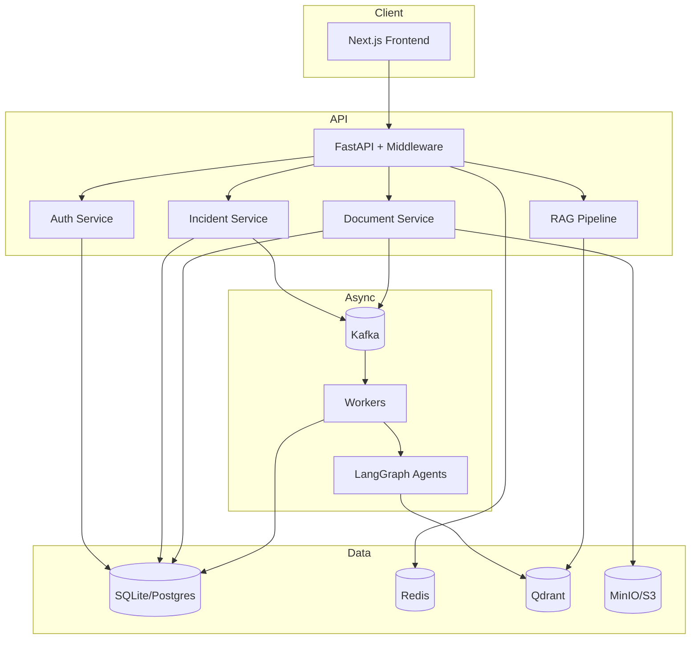

# System Architecture

## Design Decisions

1. **Clean Architecture** — routes never contain business logic; services orchestrate repositories and infrastructure ports (Kafka, Redis, S3, Qdrant, LLM).
2. **Async-first AI** — every LangGraph workflow is triggered by Kafka so API latency stays low under incident storms.
3. **Database portability** — SQLAlchemy async + Alembic; `DATABASE_URL` switches SQLite ↔ PostgreSQL without code changes.
4. **Provider-agnostic LLM** — factory selects Gemini, OpenAI, or Ollama; offline hash-embedding + deterministic fallback model for CI/dev without keys.
5. **RBAC** — role → permission sets enforced via FastAPI dependencies (`require_permission`).
6. **Graceful degradation** — Redis/Kafka/S3/Qdrant failures log warnings and continue where safe (e.g. sync path without publish).

## Component Diagram

## Module Boundaries

| Module | Responsibility |
|--------|----------------|
| auth | Register/login/refresh/OAuth, sessions |
| users | Admin user CRUD, RBAC roles |
| incidents | CRUD, analysis trigger, result apply |
| logs | Ingest & query application logs |
| documents | Upload, metadata |
| rag | Chunk/embed/search/answer |
| agents | LangGraph multi-agent graph |
| embeddings | Model factory |
| vectorstore | Qdrant client |
| reports | Postmortems |
| notifications | In-app + Slack |
| analytics | Dashboard KPIs, model usage |
| integrations | GitHub/Jira/Slack/Prometheus |
| audit | Immutable action trail |
| scheduler | Session/analytics cleanup |
