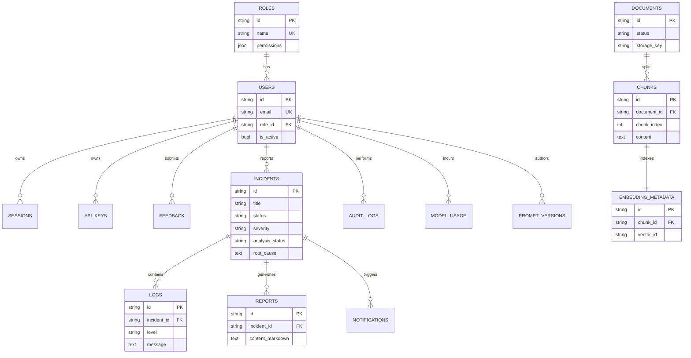

# Entity-Relationship Diagram

```mermaid
erDiagram
  ROLES ||--o{ USERS : has
  USERS ||--o{ SESSIONS : owns
  USERS ||--o{ API_KEYS : owns
  USERS ||--o{ FEEDBACK : submits
  USERS ||--o{ INCIDENTS : reports
  INCIDENTS ||--o{ LOGS : contains
  INCIDENTS ||--o{ REPORTS : generates
  INCIDENTS ||--o{ NOTIFICATIONS : triggers
  DOCUMENTS ||--o{ CHUNKS : splits
  CHUNKS ||--|| EMBEDDING_METADATA : indexes
  USERS ||--o{ AUDIT_LOGS : performs
  USERS ||--o{ MODEL_USAGE : incurs
  USERS ||--o{ PROMPT_VERSIONS : authors

  ROLES {
    string id PK
    string name UK
    json permissions
  }
  USERS {
    string id PK
    string email UK
    string role_id FK
    bool is_active
  }
  INCIDENTS {
    string id PK
    string title
    string status
    string severity
    string analysis_status
    text root_cause
  }
  LOGS {
    string id PK
    string incident_id FK
    string level
    text message
  }
  DOCUMENTS {
    string id PK
    string status
    string storage_key
  }
  CHUNKS {
    string id PK
    string document_id FK
    int chunk_index
    text content
  }
  EMBEDDING_METADATA {
    string id PK
    string chunk_id FK
    string vector_id
  }
  REPORTS {
    string id PK
    string incident_id FK
    text content_markdown
  }
```
