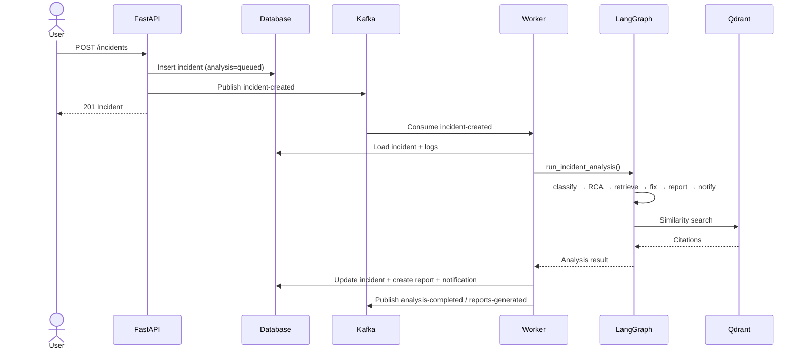
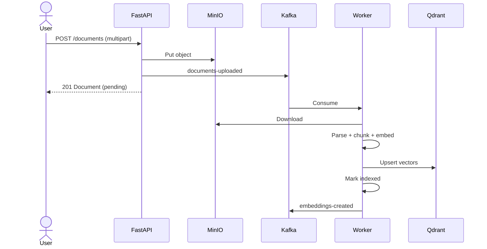

# Sequence Diagrams

## Incident Analysis Flow

```mermaid
sequenceDiagram
  actor User
  participant API as FastAPI
  participant DB as Database
  participant K as Kafka
  participant W as Worker
  participant LG as LangGraph
  participant Q as Qdrant

  User->>API: POST /incidents
  API->>DB: Insert incident (analysis=queued)
  API->>K: Publish incident-created
  API-->>User: 201 Incident

  K->>W: Consume incident-created
  W->>DB: Load incident + logs
  W->>LG: run_incident_analysis()
  LG->>LG: classify → RCA → retrieve → fix → report → notify
  LG->>Q: Similarity search
  Q-->>LG: Citations
  LG-->>W: Analysis result
  W->>DB: Update incident + create report + notification
  W->>K: Publish analysis-completed / reports-generated
```

## Document RAG Ingestion

```mermaid
sequenceDiagram
  actor User
  participant API as FastAPI
  participant S3 as MinIO
  participant K as Kafka
  participant W as Worker
  participant Q as Qdrant

  User->>API: POST /documents (multipart)
  API->>S3: Put object
  API->>K: documents-uploaded
  API-->>User: 201 Document (pending)

  K->>W: Consume
  W->>S3: Download
  W->>W: Parse + chunk + embed
  W->>Q: Upsert vectors
  W->>W: Mark indexed
  W->>K: embeddings-created
```
